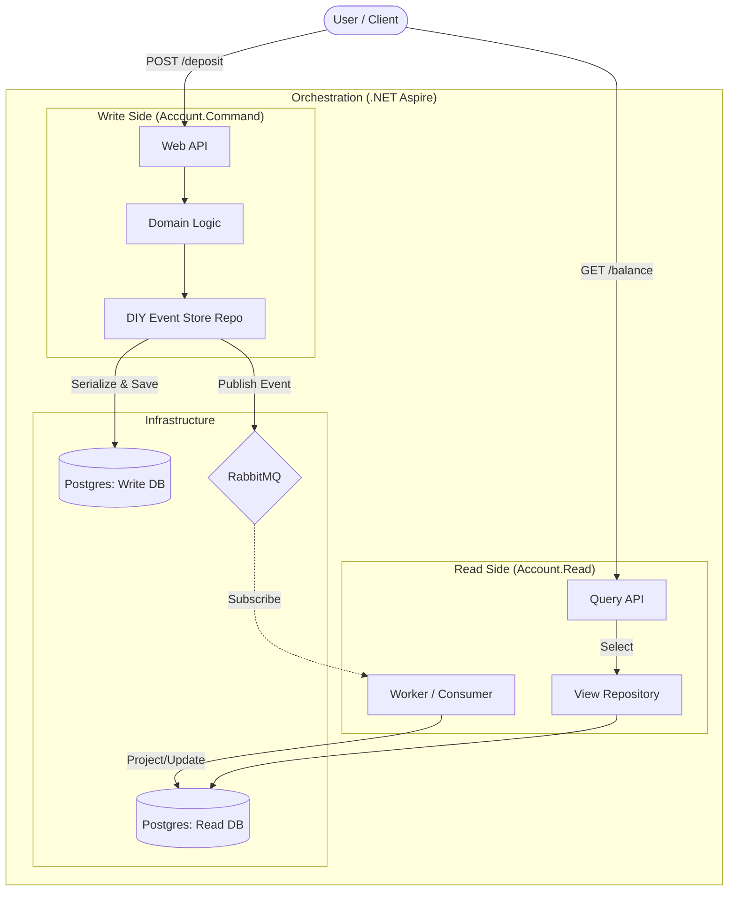

# Banky.POC 🏦

> A High-Fidelity Proof of Concept for **Event Sourcing**, **Physical CQRS**, and **Strict Clean Architecture** on **.NET 9** & **.NET Aspire**.

[](https://dotnet.microsoft.com/)
[](https://learn.microsoft.com/en-us/dotnet/aspire/)
[]()
[]()

**Banky.POC** demonstrates how to build a complex, distributed banking system using strictly decoupled microservices. Unlike typical "Hello World" examples, this project enforces **Physical Project Separation** for Clean Architecture layers and implements a **"Do-It-Yourself" (DIY) Event Store** using EF Core (no black-box libraries like Marten or EventStoreDB).

## 📐 Architecture Overview

The solution uses **Physical CQRS**, meaning the *Write Side* (Command) and *Read Side* (Query) are deployed as separate services with separate databases, synchronized via **Integration Events**.



## ✨ Key Features & Patterns

### 1. "DIY" Event Sourcing (Manual Implementation)
Instead of using Marten or EventStoreDB, this project implements the core mechanics of Event Sourcing from scratch using **EF Core**:
- **Serialization**: Converting C# Domain Events to JSON strings.
- **Versioning**: Handling Optimistic Concurrency manually via Sequence numbers.
- **Rehydration**: Replaying past events from the DB to restore Aggregate state in memory.

### 2. Strict Clean Architecture (Physical Separation)
Layers are separated by **Physical Projects** (.csproj), not just folders. This enforces Dependency Inversion via the compiler:
- `Domain`: Pure C# (.NET Standard), ZERO dependencies on EF Core or Infrastructure.
- `Application`: Depends on Domain.
- `Infrastructure`: Depends on Application & Domain. Implements the Interfaces.
- `API`: The entry point.

### 3. Physical CQRS
- **Account.Command**: Optimized for high-throughput writes (Append Only).
- **Account.Read**: Optimized for fast reads (Flat SQL Views).
- **Eventual Consistency**: Synced via MassTransit (RabbitMQ).

### 4. Cloud-Native Ready with .NET Aspire
- Uses **.NET Aspire** for local development orchestration.
- Spins up PostgreSQL (with multiple logic databases) and RabbitMQ automatically using Docker containers.
- **Platform Agnostic**: The core application code relies on standard `ConnectionStrings`, making it deployable to Kubernetes or Azure Container Apps without Aspire dependency in production.

## 🛠️ Tech Stack

- **Framework**: .NET 9
- **Orchestration**: .NET Aspire 9.0
- **Database**: PostgreSQL (via EF Core 9)
- **Messaging**: MassTransit (RabbitMQ)
- **Testing**: xUnit, FluentAssertions, NSubstitute
- **Containerization**: Docker

## 🚀 Getting Started

### Prerequisites
- [Docker Desktop](https://www.docker.com/products/docker-desktop/) (Must be running)
- [.NET 9 SDK](https://dotnet.microsoft.com/download/dotnet/9.0)
- .NET Aspire Workload:
  ```bash
  dotnet workload update
  dotnet workload install aspire
  ```

### Installation & Run

1. **Clone the repository**
   ```bash
   git clone [https://github.com/your-username/Banky.POC.git](https://github.com/your-username/Banky.POC.git)
   cd Banky.POC
   ```

2. **Run the AppHost**
   Navigate to the Aspire AppHost project and run it. This will automatically pull Docker images for Postgres and RabbitMQ.
   ```bash
   cd src/Aspire/Banky.AppHost
   dotnet run
   ```

3. **Access the Dashboard**
   The console will output a link to the **Aspire Dashboard** (usually `https://localhost:18888`). From there, you can:
   - Access the Swagger UI for `Account.Command` and `Account.Read`.
   - View RabbitMQ Management Console.
   - Inspect Distributed Traces and Logs.

## 📂 Project Structure

The solution follows a strict separation of concerns:

```text
src/
├── Aspire/                           # Orchestration Projects
├── Shared/                           # Contracts (Shared Integration Events)
├── Services/
│   ├── Account.Command/              # === WRITE SERVICE (Solution Folder) ===
│   │   ├── Account.Command.Domain/         # Aggregate Roots (Pure C#)
│   │   ├── Account.Command.Application/    # Use Cases & Handler Interfaces
│   │   ├── Account.Command.Infrastructure/ # EF Core & MassTransit impl
│   │   └── Account.Command.Api/            # REST API Endpoint
│   │
│   └── Account.Read/                 # === READ SERVICE (Solution Folder) ===
│       ├── Account.Read.Core/              # DTOs & Interfaces
│       ├── Account.Read.Infrastructure/    # Read DbContext
│       └── Account.Read.Api/               # API & Background Worker
└── tests/                            # Unit Tests
    ├── Account.Command.Domain.Tests/ # Testing Aggregates
    └── ...
```

## 🧪 Testing

To run the comprehensive Unit Tests (Domain Logic & Projections):

```bash
dotnet test
```

## 📝 License

This project is licensed under the MIT License.