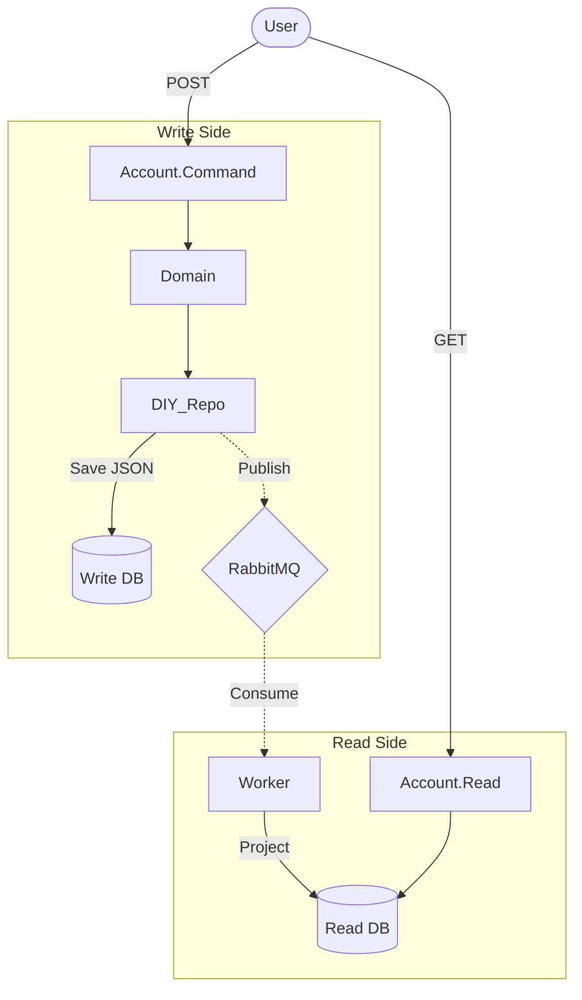

# Banky.POC 🏦

> A High-Fidelity Proof of Concept designed for my **Internal Knowledge Sharing** session on **Event-Driven Architecture Series: Event Sourcing + CQRS**.

[](https://dotnet.microsoft.com/)
[](https://learn.microsoft.com/en-us/dotnet/aspire/)
[]()

**Banky.POC** is a distributed banking system playground that demonstrates complex patterns without "magic" libraries. It enforces **Strict Clean Architecture** through physical project separation and implements a **"Do-It-Yourself" (DIY) Event Store** using EF Core.

## 📐 Architecture

The system implements **Physical CQRS**, separating Write and Read concerns into distinct microservices with their own databases, synchronized via **Integration Events**.



## ✨ Key Features

-   **DIY Event Sourcing**: Manual implementation using EF Core (Serialization, Versioning, Rehydration) to demonstrate the core mechanics without external dependencies.
-   **Physical CQRS**: Complete separation of Write (Command) and Read (Query) services/databases for scalability and isolation.
-   **Strict Clean Architecture**: Applied rigidly across all services using separate `.csproj` projects to enforce Dependency Inversion.
-   **Cloud-Native Orchestration**: Uses **.NET Aspire** to bootstrap PostgreSQL and RabbitMQ for seamless local development.

## 🛠️ Tech Stack

-   **.NET 9** & **.NET Aspire 9.0**
-   **EF Core** (PostgreSQL)
-   **MassTransit** (RabbitMQ)
-   **xUnit**, **FluentAssertions**, **NSubstitute**

## 🚀 Quick Start

1.  **Clone & Run**:
    ```bash
    git clone https://github.com/mcuong223/bank-aspire-event-sourcing-cqrs-poc.git
    cd src/Aspire/Banky.AppHost
    dotnet run
    ```

2.  **Dashboard**: Open the link in console (e.g., `https://localhost:18888`) to view services, traces, and DBs.

## 📂 Structure Overview

```text
src/
├── Aspire/                 # Orchestration (Postgres/RabbitMQ setup)
├── Shared/                 # Shared Contracts (Integration Events)
├── Services/
│   ├── Account.Command/    # Write Service (Clean Arch: Domain/App/Infra/API)
│   └── Account.Read/       # Read Service (Clean Arch: Core/Infra/API)
└── tests/                  # Unit Tests
```

## 📝 License

This project is licensed under the MIT License.